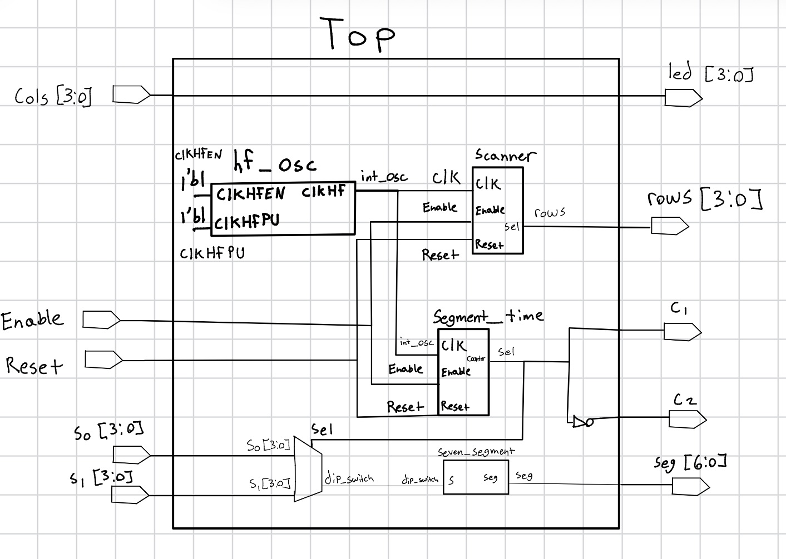
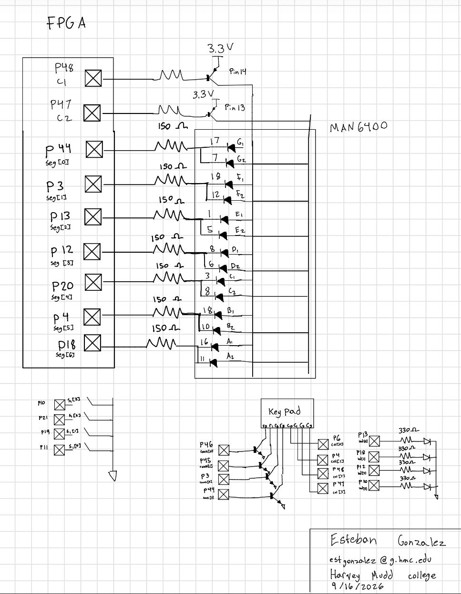
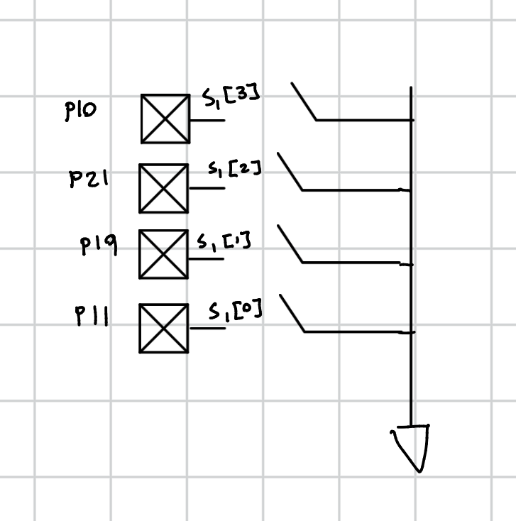
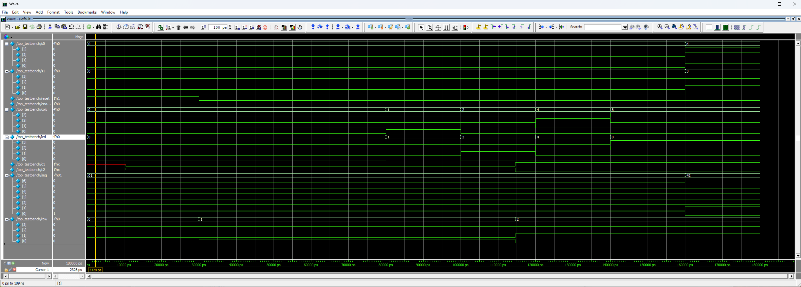
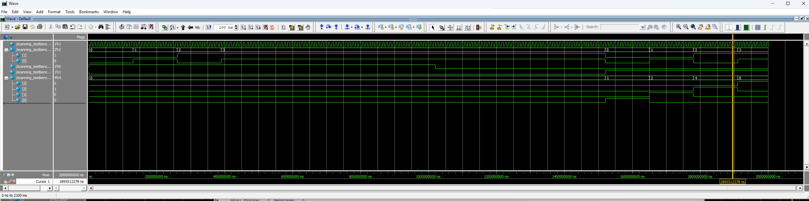

## Lab 2 - Multiplexed 7-Segment Display

### Introduction
This lab had two components. First, a system was designed to time multiplex a dual seven segment display to show 2 independent hexadecimal digits. The second part of the lab was Designing a keypad scanner that blinks a LED at 2 Hz based on the colomn key that was pressed. 

### Design and Testing Methodology

### Frequency and Resistor Calculations
To multiplex for the dual segment display, it needed to be fast enough that you can't see the digits blink, but slow enough that they don't bleed into other. After various trials, a frequency of 120 Hz was settled upon. Using the high-speed oscillator (HSOSC) from the iCE40 UltraPlus primitive library to generate a clock signal at 48 MHz.  To lower the HSOSC to the correct frequency the  following calculations were used. $count = 48 MHz/ (2 * 120 Hz)$. This gives a max count of 200,000 that was used in the counter module adapted from lab 1. The same formula was used to find the frequency for the LEDs for the keypad scanner, where the full keypad needed to be scanned twice every second. So, $count = 48 MHz/ (2 * 8 Hz)$. This gives a max count of 3,000,000 that was used in the counter instantiation for the keypad. 

For the resistors there were multiple different values that needed to be used. For the 2N3906 PNP transistors that were used to drive the common anode for the dual segment display, a 1k ohm resistor was chosen. To calculate this value, the datasheet was used to find the voltage drop across the base/emitter. Additionally, the datasheet for the FPGA was used to find the amount of current each pin can safely produce. With the emitter connected to 3.3 V, the FPGA pin connected to the base, and the collector connecting to the LED cathode with a resistor, gave the following equations. 
$R = V/I = (3.3-0.65) V / 8mA = 330$. This was the base value, but to ensure the current was limited to a safe value a 1k ohm resistor was used. For the resistor connecting the collector to the LED cathode a value of 150 ohms was used. Using the collector/emitter saturation voltage of 0.2 V from the transistor datasheet, the following calculation was carried out. Additionally, accounting for the forward voltage of the LED. 
$R = V/I = (3.3-0.2-1.8) V / 8mA = 162.5$. A standard resistor value of 150 ohms was picked.

### Technical Documentiation 
The design was developed using four modules. A top level module, a module for the counter, a module for the seven segment display, and a module for the scanner. 

The source code for the project can be found in the associated
[Github repository](https://github.com/estgonzalez-hub/Micro_Ps/tree/main/e155_Lab1)

### Block Diagram and Schematics

{fig-cap="Figure 1. Block diagram of Verilog design."}

The block diagram in Figure 1 demonstrates the overall architecture of the design. The top level module includes four submodules: the  the high-speed oscillator block (hf_osc), the scanner module(scanner), the seven segment display block (seven_segment_display), and the counter used for the seven segmend display(segment_time). 

### Schematic

{fig-cap="Figure 2. Schematic of the physical dual seven segment along with one of the switches for a digit circuit. Also shows keypad schematic."}

The schematic in Figure 2 demonstrates the physical layout of the design. The LEDs from the seven segment display were connected to 150 Ω resistors. This was calculated using R = V/I. The voltage was found by subtracting the forward voltage of the LED from the power voltage and dividing by our desired current. (3.3V - 2.1 V) / 10 mA. This gave 120 Ω, so the standard resistor of 150 Ω was chosen. The schematic also demonstrates the physical layout of the keypad and leds of thedesign.

### Testbench Simulation

The design met all intended design objectives.

{fig-cap="Figure 3. Waveform showing the top module being tested"}

The screenshot above shows the QuestaSim simulation for the top module. 

{fig-cap="Figure 4. Waveform showing the seven segment display being tested"}

The screenshot above shows the QuestaSim simulation for the seven segment module. 

### Results and Discussion 

All the prescribed tasks were accomplished. The seven segment display worked as expected, correctly shwoing two hexadecimal digits from 0 all the way to F. Pressing down on the keypad illuminated the corresponding LED and blinked it at 2 Hz. 

### Conclusion

The design successfully displayed two hexadecimal digits on a dual segment display by multiplexing at 120 Hz. The scanner successfully scanned the keypad at 2 Hz and blink the corresponding LED. 
I spent 16 hours on this lab. 

### AI Prototype Summary

When prompting an LLM with the following prompt "" it provided the following code. module time_mux_7seg (
    input  logic       clk,
    input  logic       rst_n,
    input  logic [3:0] in0,
    input  logic [3:0] in1,
    output logic [6:0] out0,
    output logic [6:0] out1
);

    // Common Anode Decoder Function (0 = LED ON, 1 = LED OFF)
    // Segment Mapping: [6:0] = {g, f, e, d, c, b, a}
    function automatic logic [6:0] decode_7seg(input logic [3:0] hex);
        case (hex)
            4'h0: decode_7seg = 7'b100_0000;
            4'h1: decode_7seg = 7'b111_1001;
            4'h2: decode_7seg = 7'b010_0100;
            4'h3: decode_7seg = 7'b011_0000;
            4'h4: decode_7seg = 7'b001_1001;
            4'h5: decode_7seg = 7'b010_0010;
            4'h6: decode_7seg = 7'b010_0000;
            4'h7: decode_7seg = 7'b111_1000;
            4'h8: decode_7seg = 7'b000_0000;
            4'h9: decode_7seg = 7'b001_0000;
            4'hA: decode_7seg = 7'b000_1000;
            4'hB: decode_7seg = 7'b000_0011;
            4'hC: decode_7seg = 7'b100_0110;
            4'hD: decode_7seg = 7'b010_0001;
            4'hE: decode_7seg = 7'b000_0110;
            4'hF: decode_7seg = 7'b000_1110;
            default: decode_7seg = 7'b111_1111; // All OFF
        endcase
    endfunction

    logic       select;
    logic [3:0] mux_in;
    logic [6:0] decoded_val;

    // 1. Time-multiplex input selection into the single decoder instance
    assign mux_in      = select ? in1 : in0;
    assign decoded_val = decode_7seg(mux_in);

    // 2. Toggle selection bit and register output for the target display
    always_ff @(posedge clk or negedge rst_n) begin
        if (!rst_n) begin
            select <= 1'b0;
            out0   <= 7'b111_1111; // Default OFF
            out1   <= 7'b111_1111;
        end else begin
            select <= ~select;
            if (select == 1'b0) begin
                out0 <= decoded_val;
            end else begin
                out1 <= decoded_val;
            end
        end
    end

endmodule

This was able to compile on Radiant but I didn't flash it to my FPGA. Additionally, it provided helpful tips for the hardware 
"Physical PCB Multiplexing Variant (Shared Segment Pins + Anode Enable)
If your hardware utilizes a single physical 7-bit bus (seg) with active-low digit enable pins (anode), replace the output registers with an anode toggle:"

When plugging in the file generated, with a fresh prompt, it correctly identified that the file should produce the output it says. It also provides different alternatives as to why it could not be working, such as If your project utilizes an internal decoder function rather than a separate module instance, replace decoder_inst with the function call:

I think AI is best used to help debug and catch syntax errors. Sure it provided a "working" file, but there is a high chance it won't work as intended. Rather using AI as a tool to help catch logic mistakes or places where you're going astray seems to be the best way to do it. 