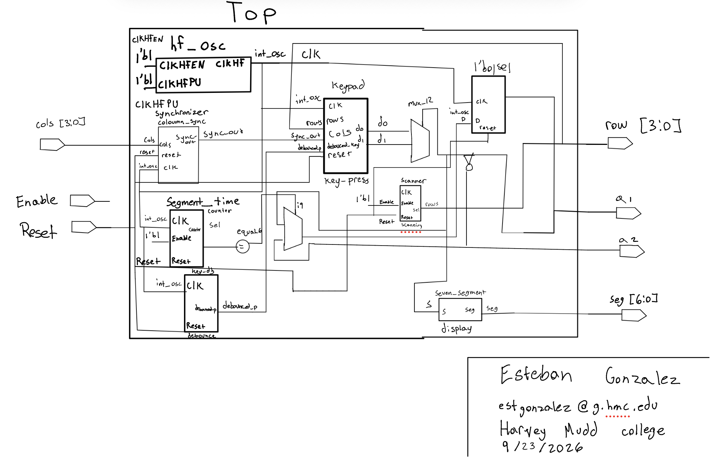
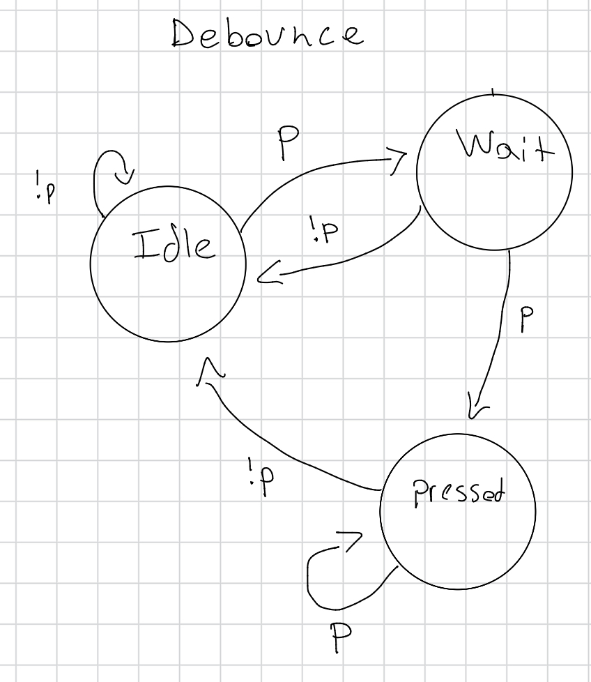
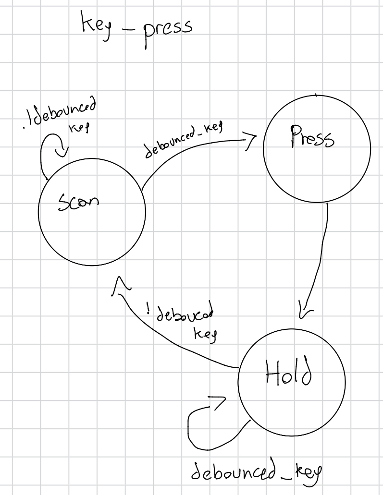
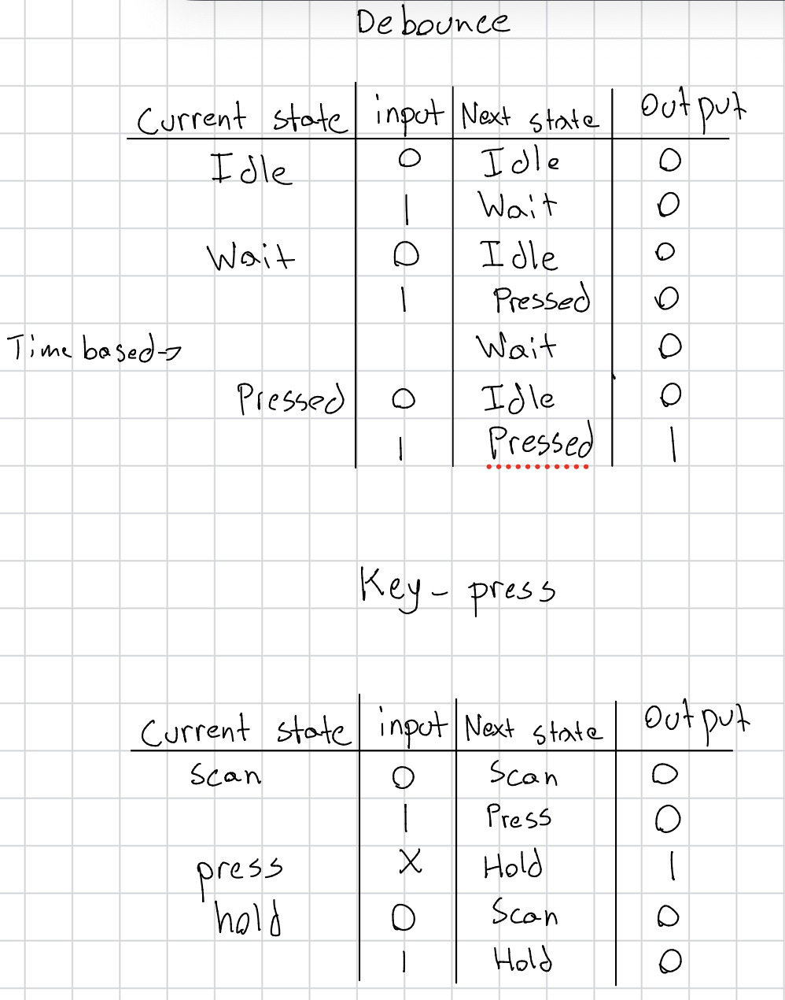
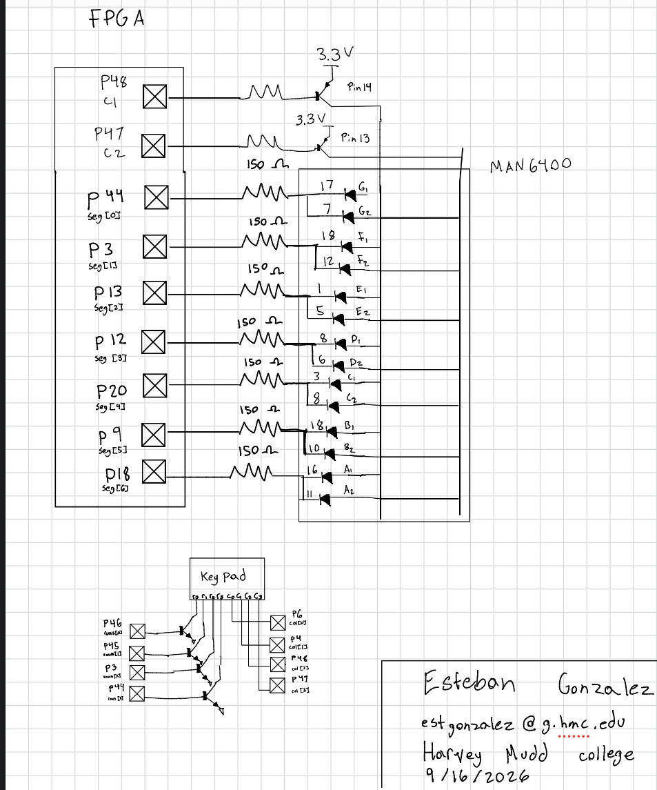
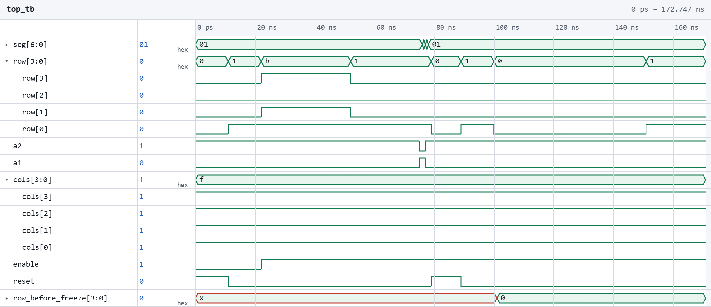
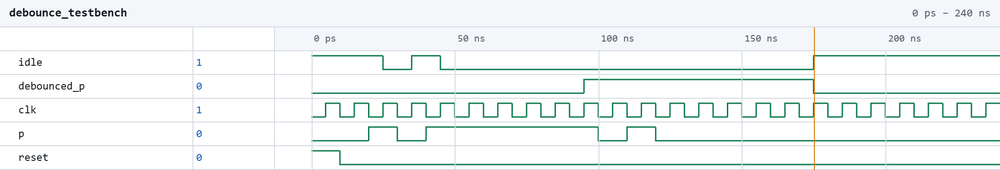
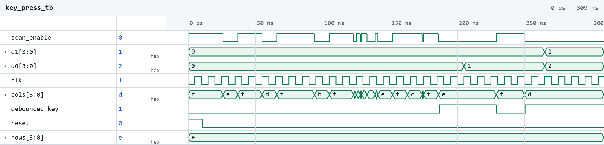
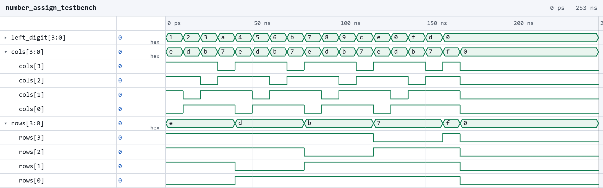

## Lab 3 - Keypad Scanner

### Introduction
This lab used the skills acquired in labs 1 and 2. A system was designed to time multiplex a dual seven segment display to show 2 independent hexadecimal digit and those digits would be read from the presses of a keypad. 

### Design and Testing Methodology
The design was developed to address the key bouncing that occurs on keyboards and still produce a desired output. My strategy to address the debouncing was first to send all the coloumn inputs through a synchronizer. This ensures there are no metastable values. When it receives an input, it enters a wait state. This just checks that p is the same value for the period. Once it passes that condition, it goes to a pressed state that outputs a 1, indicating that there has been a valid key pressed. Different types of FSMs were used. A FSM was used to address the bouncing of the physical keys and another FSM was used to control the display registers. These two FSMS were communicating in only one direction. The debounce module communicated to the key_press FSM to alert it when a key was pressed for a valid amount of time. I decided that they didn't need to communicate between each other, as the debounce FSM can be updated straight from the coloumns of the keypad. The FSM is running all the time, and only changes states when it gets a signal from the keypad. For the purpose of this lab, that was fine as there were no power or hardware constraints. 

### Technical Documentiation 
The design was developed using eight modules. A top module, a counter module, a seven segment display module, a scanner module, a debounce module, a key press module, a synchronizer module, and a number assign module.  

The source code for the project can be found in the associated
[Github repository](https://github.com/estgonzalez-hub/Micro_Ps/tree/main/e155_Lab3)

### Block Diagram, Schematics, and state diagrams

{fig-cap="Figure 1. Block diagram of Verilog design."}

The block diagram in Figure 1 demonstrates the overall architecture of the design. The top level module includes seven submodules.

{fig-cap="Figure 2. FSM for debounce module"}

{fig-cap="Figure 3. FSM for key_press module"}

{fig-cap="Figure 4.Truth tables for FSMs above."}

### Schematic

{fig-cap="Figure 2. Schematic of the physical dual seven segment along with the physical keypad."}

The schematic in Figure 2 demonstrates the physical layout of the design. The LEDs from the seven segment display were connected to 150 Ω resistors. This was calculated using R = V/I. The voltage was found by subtracting the forward voltage of the LED from the power voltage and dividing by our desired current. (3.3V - 2.1 V) / 10 mA. This gave 120 Ω, so the standard resistor of 150 Ω was chosen. The schematic also demonstrates the physical layout of the keypad. 

### Testbench Simulation

The design met all intended design objectives.

{fig-cap="Figure 3. Waveform showing the top module being tested"}

The screenshot above shows the QuestaSim simulation for the top module. 

{fig-cap="Figure 4. Waveform showing the debounce module being tested."}

The screenshot above shows the QuestaSim simulation for the debounce module. 

{fig-cap="Figure 5. Waveform showing the key press module being tested."}

The screenshot above shows the QuestaSim simulation for the keypress module. 

{fig-cap="Figure 4. Waveform showing the number assign module being tested."}

The screenshot above shows the QuestaSim simulation for the debounce module. 

### Results and Discussion 

All the prescribed tasks were accomplished. The seven segment display worked as expected, correctly shwoing two hexadecimal digits from 0 all the way to F. Pressing down on the keypad illuminated the corresponding digit on the display. There are some sketchy spots. Sometimes, realeasing a button on the keypad causes a random number to show up. Additionally, the button on the key pad needs to be pressed down firmly and all the way to correctly show the digit. 

### Conclusion

The design successfully displayed two hexadecimal digits on a dual segment display by reading the inputs from a 4x4 keypad. 
I spent too many hours on this lab. 

### AI Prototype Summary

When prompting an LLM with two disinct prompts, a monolothic versus modular prompts I noticed two differences. The monolothic prompt took longer to give back output than the modular prompts. Additionally, the monolothic output just wasn't as flushed out as compared to modular prompts. The code it provided did compile, but it was not that readable. It stuffed a lot of logic in a few modules that probably could've had better readibility if it was split up into smaller modules. The modular output did a better job at this, as the code it provided was easier to follow and debug