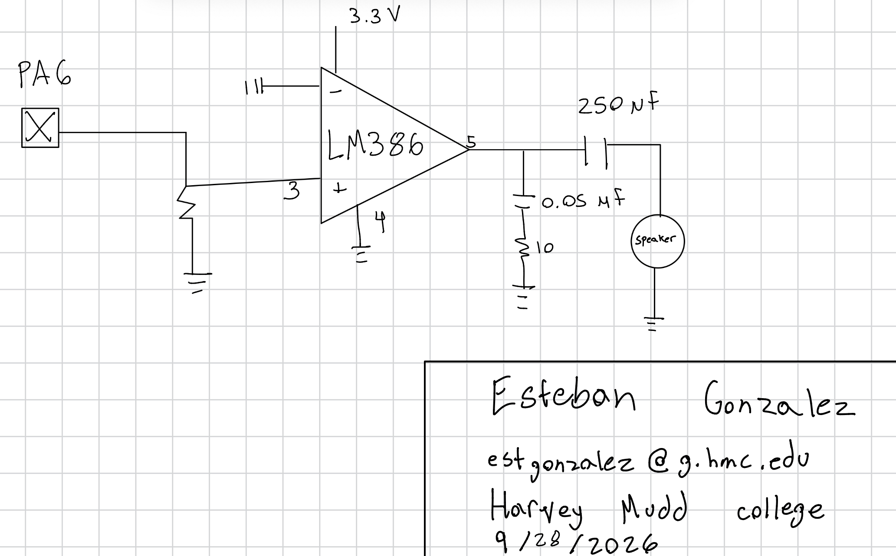

## Lab 4 - Digital Audio

### Introduction

In this lab, the STM32L432KC was used to read an array of frequency and duration numbers and generates a corresponding square wave to play a song on a speaker. 

### Design and Testing Methodology

The design was developed using TIM15 and TIM16 for the duration and frequency. Additionally, my own device drivers were made from scratch using only the reference manual as a reference. A total of five header files were created to meet the design requirements. 

The source code for the project can be found in the associated
[Github repository](https://github.com/estgonzalez-hub/Micro_Ps)

### Calculations
The minimum duration of a note was calculated the following way:

The maximum duration of a note was calculated the following way:

The maximum frequency of a note was calculated the following way:

The minimum frequency was calculated the following way: 

The calculations for all the notes of Fur Elise is below: 
<iframe src="https://docs.google.com/spreadsheets/d/e/2PACX-1vRyViy7JWPQBBZ94MI-grA6d8Q5XPr4eMw4vzxMXkO0Kxr3c2jL587PqJWSTTV62l4VDhm6-9Res4NC/pubhtml?gid=0&amp;single=true&amp;widget=true&amp;headers=false"></iframe>

### Schematic

{fig-cap="Figure 1. Schematic of the physical audio amplifier and speaker circuit."}

The schematic in Figure 1 demonstrates the physical layout of the design. The pin was connected to a potentiameter. This allowed the volume of the speaker to be adjusted. The aplifier had a gain of 20, and allowed the music notes to be played at a suitable noise level. 

### Conclusion

All the prescribed tasks were accomplished successfully. The speaker played Fur Elise, and the code is able to be easily modified to play a song of the user's choice. For my purpose, I played the Imperial March from Star Wars.

### AI Prototype Summary

The LLM can be a useful tool to sift through large documents. When tasked to find a timer that is suitable for this project, it listed all the potential timers I can use. This list was the most helpful, as it narrows down the scope and allows you to easily go find those specific timers in the manual. It then made a suggestion to use TIM2. I did not use this timer, but it could be feasible using it. 

It did say that it recommended the timer I used, which leads me to beleive it's other suggestions are good as well. Over all, an LLM can be a useful tool to help narrow the scope down when lookng at a document. Instead of looking through a 1600 pages, it tells you what is feasible and where you can find more information on them. Much more manageable. 
