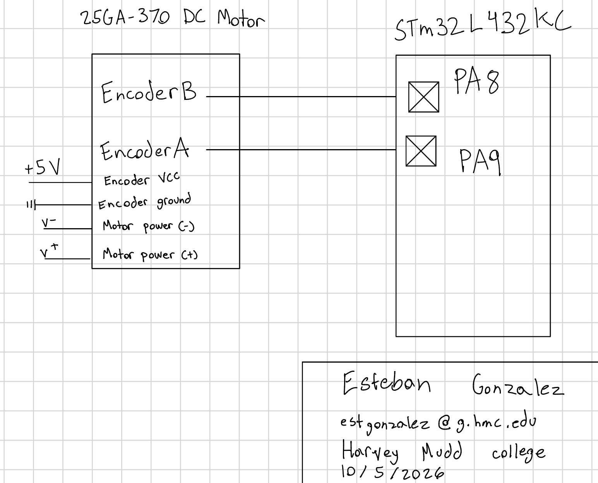
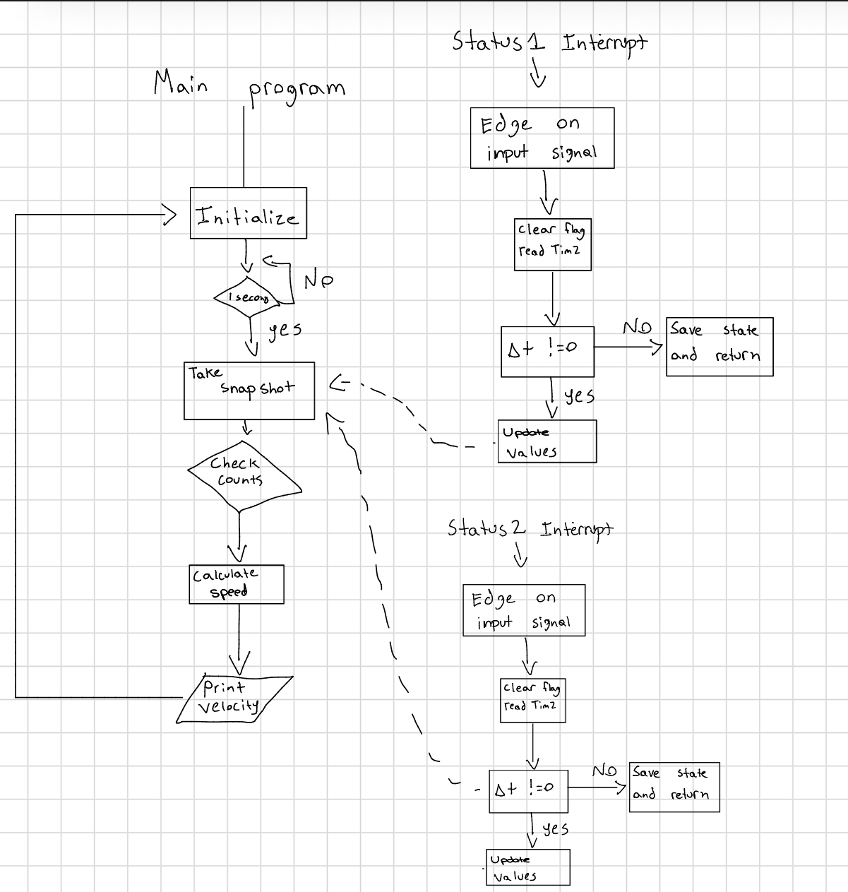

## Lab 5 - Interrupts

### Introduction

In this lab, the STM32L432KC was used to read an encoder with two channels to determine the angular velocity of a brushed DC motor. 

### Design and Testing Methodology

The design was developed using TIM2 and interrupts. Interrupts were used to accurately read the signals from the encoder at high speeds. A total of three header files were created to meet the design requirements. 

The source code for the project can be found in the associated
[Github repository](https://github.com/estgonzalez-hub/Micro_Ps)

### Calculations
The encoder has 2 channels that are 90 degrees out of phase with each other. As the motor spins, one channel goes high while the other stays low. Then as the motor continues spinning, the orignal channel goes low while the other goes high. This pattern generates a square wave that we can feed as an input into our microcontroller. The microcontroller then can read these square waves and calculate how many revoloutions the motor is doing. To find the revoloutions or angular velocity, the following calculations were used and implemented in software. 

The angular velocity of the motor was calculated as follows:

First, we calculated the time between pulses and converted it to seconds

$t = (current pulse - previous pulse)/1,000,000 us$

Next, we need to calculate the frequency of the pulse in counts per second:

$freq = (current count - previous count)/t$

Lastly, we can calculate angular frequency revs/sec using the two values we already found:

$angular velocity = freq/ t * 4*counts$

where counts is the counts per revoloution of the motor. This value can be found from the motor datasheet. The reason we multiply by four is because in our code we look at the rising and falling edge of each encoder channel. The datasheet only reports the rising edge of one channel. 

To verify the angular speed, an oscilliscope was used to measure the actual frequencies of the enncoder channels. Using the 12 V motor in the lab, the oscilliscope probe was connected to channel A. It was reading a frequency of 1.143 kHZ. We know the motor produces 408 pulses per revoloution, so plugging in these numbers into our calculations gives us:

$angular velocity = (1.142 kHz)/ 408 pulses = 2.79 revs/sec$

There is important things to consider when it comes to using interrupts versus polling at high speeds. In the case of the motor, that the encoder is constantly sending signals it is actually better to use polling instead of interrupts. The reason is that the motor speed can become fast enough that the pulse edges are arriving faster than the time it takes to process one ISR. This would make the main() code freeze, and the code we upload would effectively be trash. If you go the polling route, you can choose the sample rate which wouldn't cause any negative effects in your code. For example, if the encoder was sending pulses at 4 MHz, an edge would arrive roughly once every 250 ns. This means the CPU has to read and update registers 4 million times per second. This also happens to be the speed the mcu clock is at, so it effectively jams the program. It won't be able to execute code as it will be too busy handling the interrupts the entire time.power.  

### Schematic and Flowchart

{fig-cap="Figure 1. Schematic of the encoder and brushed DC motor used."}

The schematic in Figure 2 demonstrates the physical layout of the design. Pins 8 and 9 were connected to channels A and B of the encoder. This allowed the microcontroller to read the signals from the encoder and calculate the angular velocity. 

{fig-cap="Figure 2. Flowchart of the two interrupt handlers used in this lab."}

The flowchart above represents the interrupts used for this lab.

### Conclusion

All the prescribed tasks were accomplished successfully. The microcontroller was able to accurately read the revoultions per second of the motor. Even at full speed or extremely low speed, the microcontroller was still able to report sensible values for angular velocity. 

### AI Prototype Summary

After plugging in "Write me interrupt handlers to interface with a quadrature encoder. I’m using the STM32L432KC, what pins should I connect the encoder to in order to allow it to easily trigger the interrupts?" to gemini, it gave me surprisingly good recommendations. It recommended pins PA0 and PA1 which map directly to TIM2. Outside of that, the output of gemini was not the best. It provided a lot of extra things that were not neccessary, such as an error counter and a "Hardware input filter to suppress bounce noise". I believe the encoders don't have bounce noise as they are not buttons. 

