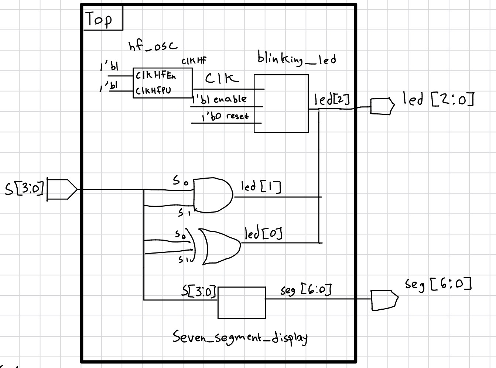
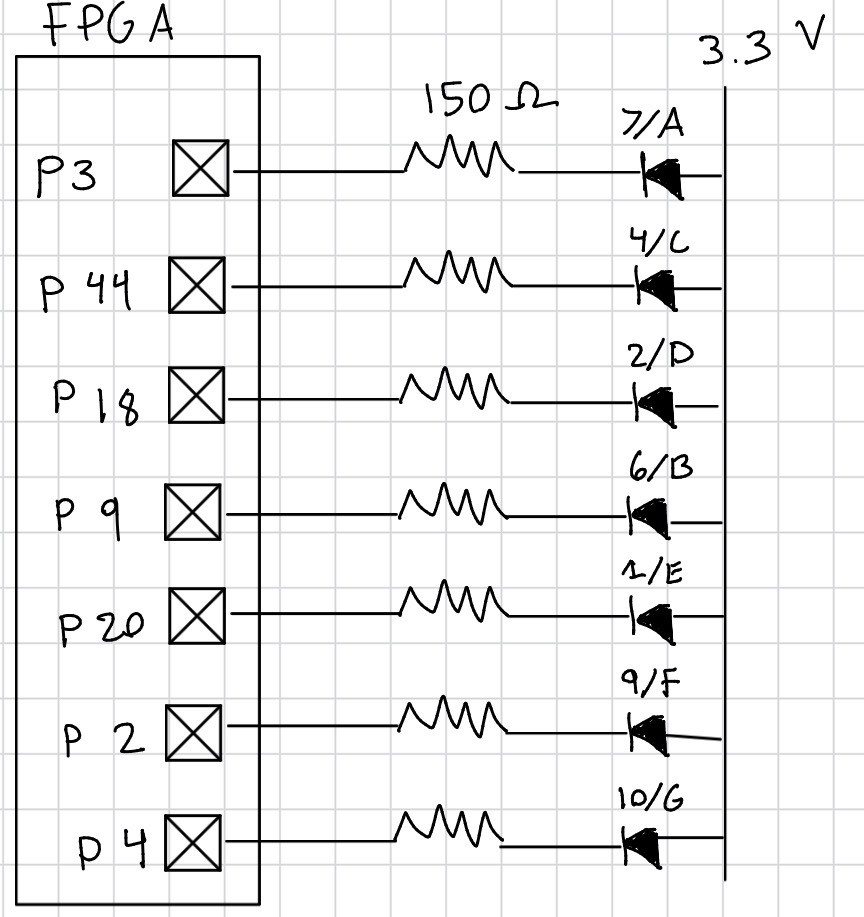
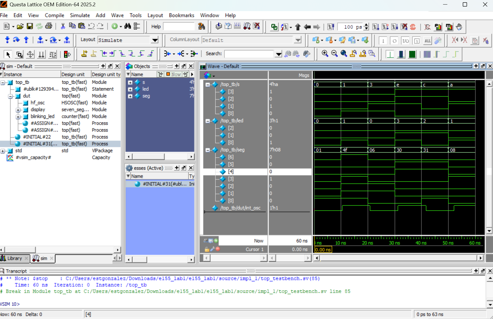
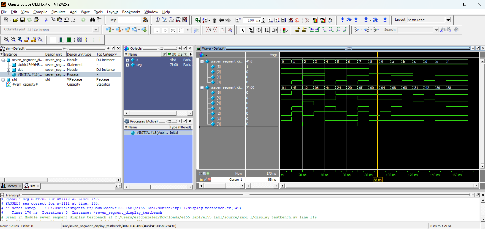

This page contains a summary of the labs completed for E155.

## Lab 1 - Board Assembly and Testing

### Introduction

In this lab, the E155 board was assembled and tested it. After soldering all the components on, the FPGA was programmed 
to show hexadecimal digits on a 7 segment LED display. It takes four switches as binary inputs and outputs the corresponding hexadecimal digit. Additionally,  an LED was blinked at 2.4 Hz using the 's internal HSOSC oscillator and lowering it using a counter 

### Design and Testing Methodology

The high-speed oscillator (HSOSC) from the iCE40 UltraPlus primitive library was used to generate a clock signal at 24 MHz. A counter was then used to divide the clock signal down so the LED could blink at 2.4 Hz and make it easier to visualize. For the seven segment display, a case statement was used to assign all the inputs from the switches to the corresponding hexadecimal digit. The pins were carefully assigned from the FPGA to ensure they drove the intended section of the of seven segment display. 

The design was developed using three modules. A top level module, a module for the counter, and a module for the seven segment display. 

The source code for the project can be found in the associated
[Github repository](https://github.com/estgonzalez-hub/Micro_Ps/tree/main/e155_Lab1)

### Technical Documentation

Figure 1. Block diagram of Verilog design.

The block diagram in Figure 1 demonstrates the overall architecture of the design. The top level module includes three submodules: the  the high-speed oscillator block (hf_osc), the counter module (blinking_led), and the seven segment display block (seven_segment_display). 

### Schematic

Figure 2. Schematic of the physical circuit.

The schematic in Figure 2 demonstrates the physical layout of the design. The LEDs from the seven segment display were connected to 150 Ω resistors. 

### Results and Discussion 

All the prescribed tasks were accomplished. The seven segment display worked as expected, correctly shwoing the hexadecimal digits from 0 all the way to F. The LED blinked at 2.4 Hz showing it was designed correctly.

### Testbench Simulation

The design met all intended design objectives.

Figure 3. Waveform showing the top module being tested

Figure 3 shows a screenshot of the QuestaSim simulation for the top module. 

Figure 4. Waveform showing the seven segment display being tested

Figure 4 shows a screenshot of the QuestaSim simulation for the seven segment module. 

![Figure 5. Waveform showing the counter and led[2]](images/counter.png)
Figure 5. Waveform showing the counter and led[2]

Figure 4 shows a screenshot of the QuestaSim simulation for the counter module. 

### Conclusion

The design successfully blinked an LED at 2.4 Hz and drove a seven segment LED display using switches as inputs. The intenral high-speed oscillator was used to generate the clock signal for the counter. I spent about 20 hours on this lab. 

### AI Prototype Summary

An LLM can be a helpful tool to write code. With a relatively short prompt, "Write SystemVerilog HDL to leverage the internal high speed oscillator in the Lattice UP5K FPGA and blink an LED at 2 Hz. Take full advantage of SystemVerilog syntax, for example, using logic instead of wire and reg." The LLM was able to generate a file that was ready to be compiled. I tried to compile the file but ran into errors. I then had to paste the error messages a few more times before it was able to compile. I noticed that the AI was good about writing comments and describing what each code snippet should do. It wasn't the best at writing code from scratch, and instead was more useful for debugging. It quickly caught syntax errors and identified issues when prompted. A useful way to levarage AI when making a design in Radiant is to use it as a debugging tool. It can explain error and warining messages and provide more context as to what Radiant is trying to tell you. 

## Lab 2 - Multiplexed 7-Segment Display

Description of Lab 2.

## Lab 3 - Keypad Scanner

Description of Lab 3.

## Lab 4 - Digital Audio

Description of Lab 4.

## Lab 5 - Interrupts

Description of Lab 5.

## Lab 6 - The Internet of Things and Serial Peripheral Interface

Description of Lab 6.

## Lab 7 - The Advanced Encryption Standard (AES)

Description of Lab 7.